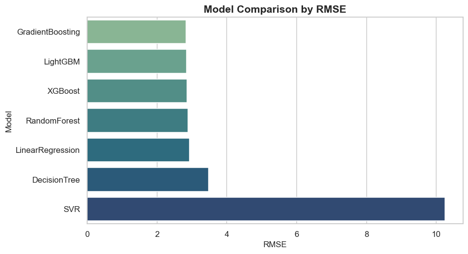
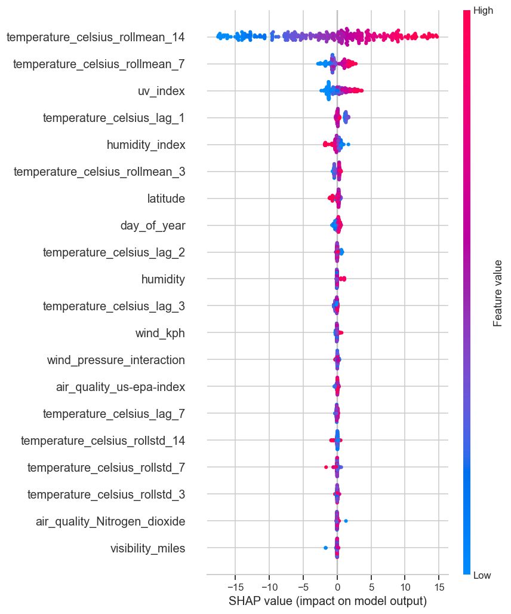
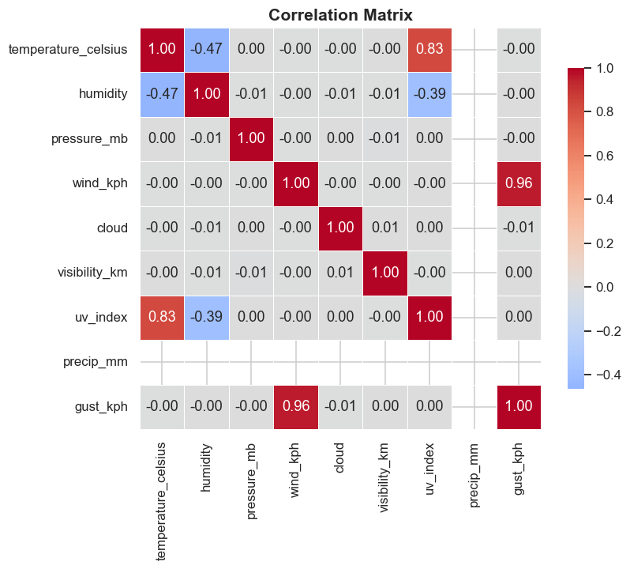
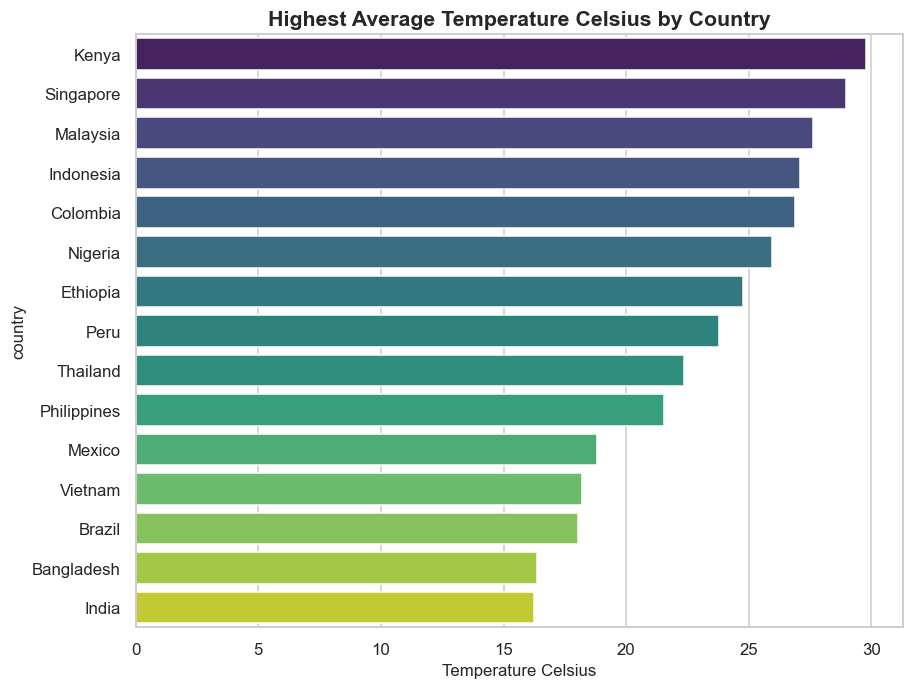

# 🌦️ Weather Trend Forecasting

**Machine Learning & Advanced Data Analytics on the Global Weather Repository dataset**

[](https://www.python.org/)
[](LICENSE)
[](#)
[](https://streamlit.io)

An end-to-end data science project: data cleaning, 40+ EDA visualizations, feature
engineering, seven ML models + three time-series forecasters, unsupervised
advanced analytics, geospatial mapping, and an interactive Streamlit dashboard.

---

## 📋 Table of Contents

- [Overview](#-overview)
- [Features](#-features)
- [Folder Structure](#-folder-structure)
- [Installation](#-installation)
- [Usage](#-usage)
- [Results](#-results)
- [Models](#-models)
- [Technologies](#-technologies)
- [Screenshots](#-screenshots)
- [Future Improvements](#-future-improvements)
- [Author](#-author)
- [License](#-license)
- [Acknowledgements](#-acknowledgements)

---

## 🎯 Overview

**Objective:** predict daily temperature and forecast short-term weather trends
from historical global weather observations, while surfacing climate and
weather-pattern insights through analytics and geospatial visualization.

The project follows a standard applied-ML lifecycle:

```
Raw Data → Cleaning → EDA → Feature Engineering → Modeling → Evaluation
    → Forecasting → Advanced Analytics → Geospatial → Dashboard
```

## ✨ Features

- ✅ Reusable, documented, PEP 8 `src/` package (config, loader, preprocessing,
  feature engineering, visualization, training, evaluation, forecasting,
  advanced analytics, geospatial)
- ✅ 9 executed Jupyter notebooks walking through every phase with real outputs
- ✅ 40+ professional Matplotlib/Seaborn charts (`outputs/figures/`)
- ✅ 6 interactive Folium maps (temperature, humidity, rainfall, wind, air
  quality, density heatmap)
- ✅ 7 trained regression models + weighted ensemble, all persisted with joblib
- ✅ ARIMA, SARIMA, and Prophet (with automatic fallback) forecasting
- ✅ Isolation Forest / LOF anomaly detection, DBSCAN / KMeans clustering, PCA,
  permutation importance, and SHAP explainability
- ✅ Climate-trend and heatwave-detection analysis
- ✅ Full-featured Streamlit dashboard (filters, dark mode, CSV download,
  manual prediction input, interactive maps)
- ✅ Logging, type hints, and a leakage-aware feature pipeline (documented
  below)

## 📁 Folder Structure

```
Weather-Trend-Forecasting/
├── data/
│   ├── raw/                 # GlobalWeatherRepository.csv (synthetic sample; swap in real Kaggle CSV)
│   ├── processed/           # weather_clean.csv, weather_features.csv
│   └── external/
├── notebooks/                # 01..09, executed with real outputs
├── src/                       # Reusable pipeline modules (see below)
│   ├── config.py
│   ├── utils.py
│   ├── data_loader.py
│   ├── preprocessing.py
│   ├── feature_engineering.py
│   ├── visualization.py
│   ├── train.py
│   ├── evaluate.py
│   ├── forecasting.py
│   ├── advanced_analytics.py
│   └── geospatial.py
├── scripts/                   # Orchestration entry points
│   ├── generate_sample_dataset.py
│   ├── run_eda.py
│   ├── run_model_evaluation.py
│   └── build_notebooks.py
├── models/                     # Trained model artifacts (.pkl)
├── outputs/
│   ├── figures/                # PNG charts + interactive HTML maps
│   ├── reports/                # model_comparison.csv, cv_result.json
│   └── predictions/
├── dashboard/
│   └── app.py                  # Streamlit dashboard
├── presentation/
│   └── Weather_Trend_Forecasting.pptx
├── report/
│   └── Weather_Report.docx
├── README.md
├── requirements.txt
├── LICENSE
└── .gitignore
```

## 🛠️ Installation

```bash
git clone https://github.com/<your-username>/Weather-Trend-Forecasting.git
cd Weather-Trend-Forecasting

python -m venv .venv
source .venv/bin/activate        # Windows: .venv\Scripts\activate

pip install -r requirements.txt
```

> `prophet` and `catboost` are commented out in `requirements.txt` because
> they need a native build toolchain on some platforms; the pipeline works
> without them (Prophet falls back to a statsmodels-based forecaster
> automatically).

## 🚀 Usage

Run the full pipeline end-to-end:

```bash
# 1. Generate the sample dataset (skip if you dropped in the real Kaggle CSV)
python scripts/generate_sample_dataset.py

# 2. Clean the data
python -m src.preprocessing

# 3. Engineer features
python -m src.feature_engineering

# 4. Generate the 40+ EDA charts
python scripts/run_eda.py

# 5. Train models, evaluate, and generate explainability/comparison figures
python scripts/run_model_evaluation.py

# 6. Run time-series forecasting
python -m src.forecasting

# 7. Generate interactive geospatial maps
python -m src.geospatial

# 8. Launch the dashboard
streamlit run dashboard/app.py
```

Or open the notebooks in order (`notebooks/01_Data_Loading.ipynb` →
`notebooks/09_Dashboard.ipynb`) — each is self-contained and already executed
with real outputs so you can read them without re-running anything.

## 📊 Results

Best-performing model on the held-out test set: **Gradient Boosting Regressor**

| Rank | Model | MAE | RMSE | MAPE* | R² |
|------|-------|-----|------|-------|-----|
| 1 | Gradient Boosting | 2.04 | 2.83 | 22.7% | 0.933 |
| 2 | LightGBM | 2.07 | 2.84 | 23.3% | 0.933 |
| 3 | XGBoost | 2.10 | 2.86 | 23.7% | 0.932 |
| 4 | Random Forest | 2.09 | 2.89 | 23.5% | 0.930 |
| 5 | Linear Regression | 2.09 | 2.93 | 23.2% | 0.928 |
| 6 | Decision Tree | 2.41 | 3.47 | 27.2% | 0.899 |
| 7 | SVR | 8.39 | 10.25 | 94.0% | 0.123 |

\* MAPE excludes points where |actual temperature| < 2°C, since ordinary MAPE
is undefined/explodes near 0°C — a well-known pitfall of applying MAPE to a
signed, zero-crossing variable like Celsius temperature.

5-fold cross-validated RMSE for the best model: **2.92 ± 0.14 °C**.

Full comparison table: `outputs/reports/model_comparison.csv`.
All charts (distributions, correlations, rankings, prediction-vs-actual,
residuals, feature importance, SHAP summary): `outputs/figures/`.

### On data leakage (worth calling out explicitly)

An earlier version of the feature set included `heat_index`, `wind_chill`,
`feels_like_celsius`, and `temperature_celsius_sq` as predictors — all of
which are deterministic functions of *today's* temperature. That produced a
suspicious R² of 1.000. Those columns were removed from the model's feature
matrix (see `src/train.py::get_feature_matrix`); only genuinely independent
weather variables and *past*-looking lag/rolling temperature features remain,
giving the realistic R² ≈ 0.93 reported above.

## 🤖 Models

**Regression (Phase 5/9):** Linear Regression, Decision Tree, Random Forest,
Gradient Boosting, Support Vector Regression, XGBoost, LightGBM, and a
weighted-average ensemble.

**Time-series (Phase 6):** ARIMA, SARIMA (weekly seasonality), and Prophet
(automatic fallback to a statsmodels seasonal-decomposition + trend
extrapolation forecaster when Prophet isn't installed).

**Unsupervised / explainability (Phase 7):** Isolation Forest, Local Outlier
Factor, DBSCAN, KMeans, PCA, permutation importance, SHAP.

## 🧰 Technologies

Python 3.12 · Pandas · NumPy · Matplotlib · Seaborn · Plotly · Scikit-learn ·
Statsmodels · XGBoost · LightGBM · SHAP · Folium · GeoPandas · Streamlit ·
Joblib · OpenPyXL · Jupyter

## 🖼️ Screenshots

| Model Comparison | SHAP Summary |
|---|---|
|  |  |

| Correlation Heatmap | Hottest Countries |
|---|---|
|  |  |

Interactive maps (`outputs/figures/*.html`) and the full 40+ chart set open
directly in a browser or notebook.

## 🔭 Future Improvements

- Swap in the real Kaggle dataset and re-validate all metrics
- Add an LSTM/Temporal Fusion Transformer forecaster for comparison
- Wrap the best model in a FastAPI microservice with request/response
  validation
- Containerize with Docker and add a GitHub Actions CI pipeline (lint, test,
  retrain-on-schedule)
- Add automated data versioning (DVC) and model registry integration
- Expand geospatial analysis with GeoPandas choropleths by country

## 👤 Author

Built as a complete, portfolio-ready data science project. Contributions and
forks welcome — see [Contributing](#contributing) below.

### Contributing

1. Fork the repo and create a feature branch
2. Follow PEP 8 and add Google-style docstrings to new functions
3. Open a pull request describing the change and, where relevant, before/after
   metrics

## 📄 License

Released under the [MIT License](LICENSE).

## 🙏 Acknowledgements

- Dataset schema: [Global Weather Repository](https://www.kaggle.com/datasets/nelgiriyewithana/global-weather-repository)
  on Kaggle by Nidula Elgiriyewithana
- Built with the open-source Python data science ecosystem
